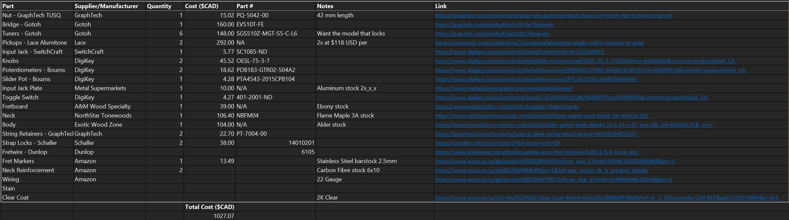

---
hide:
  - toc
---

Most aspects of the build process are covered in my video <a href="https://www.youtube.com/" target="_blank">here</a>

*Bill of Materials*

To build this guitar you will need to CNC machine the body, neck, backplates, and input jack plate. The recommended tooling is outlined below.

| Tool | Shank Diameter | Cutting Diameter | Cutting Length |
|--------------|--------------|--------------|--------------|
| Upcut Router Bit/Endmill  | 1/4" | 1/4" | 1" |
| Upcut Router Bit/Endmill | 1/4" | 1/4" | 2" |
| Upcut Ball-nose Router Bit/Endmill | 1/4" | 1/4" | 1" |
| Upcut Router Bit/Endmill | 1/8" | 1/8" | 1" |
| Upcut Router Bit/Endmill | 0.6 mm | 1/8" | 1" |

