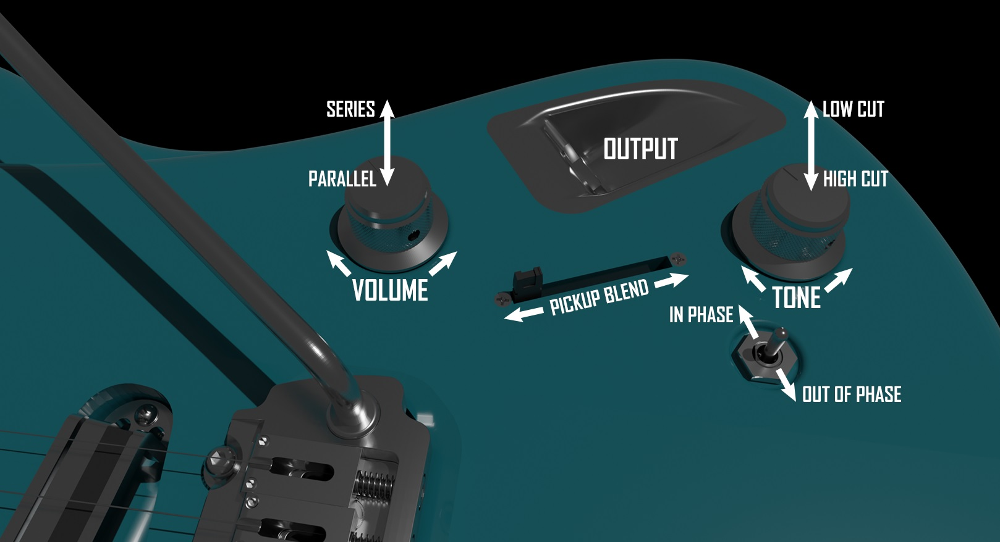

---
hide:
  - toc
---

# Controls

*Controls Diagram*

The controls layout is intended to allow for a very wide range of sounds with minimal components.

When the volume pot is pushed in, the pickups are connected in parallel, and their signals can be blended using the slide pot. This allows for any amount of blend between the positions unlike a 3 or 5-way switch. When the volume pot is pulled out, the pickups are connected in series as with a humbucker, for increased output and thicker sound. In this cased the pickup blend has no effect.

When the tone pot is pushed in, it functions like a conventional tone pot, cutting high frequencies. When the tone pot is pulled out, the knob cuts low frequencies instead.

The toggle switch allows the phase of the pickups to be reversed. When phase is reversed, there is cancellation between the 2 pickups waveforms for a thinner and quirkier sound.

A wiring diagram is given below. This can also be downloaded from the repository for higher resolution.

*Wiring Diagram*
